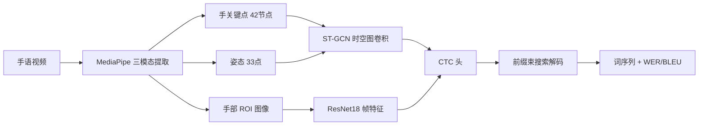

# SignBridge — 中文连续手语识别（CSLR）

> **视频 → MediaPipe 关键点 → ST-GCN 时空图卷积 → CTC 解码 → 词汇序列（WER / BLEU 评估）**
> 从零构建的完整手语翻译系统：数据管线、模型族、训练框架、解码优化、评估分析全链路。

---

## 📌 项目亮点（速览）

| 维度 | 内容 |
|---|---|
| **任务** | 连续手语识别（Continuous Sign Language Recognition）：手语视频 → 词序列（gloss），非孤立词分类 |
| **数据** | CE-CSL 公开数据集（5988 视频 / 12 手语者 / 3836 词汇 / 复杂背景），自建三模态提取管线 |
| **模型** | 骨架 ST-GCN 家族（CTC 变体 × 3）+ 三流融合（hand+pose+RGB ROI）+ TFNet 时频双分支复现 |
| **训练** | CTC loss、在线增强、warmup、ReduceLROnPlateau、断点续跑、batch 级断点、tqdm 进度条 |
| **解码** | 前缀束搜索（Hannun 2016）+ 长度偏置（length_bonus）+ LM 重打分（实验） |
| **评估** | WER / 句准确率 / BLEU-1~4 / 三桶细粒度分析（句长·手语者·词频） |
| **工程** | 195 tests 全过；两次深度排障沉淀为 Postmortem 文档（见下） |

---

## 🏗 系统架构



**数据管线**：`视频 → 检测率质量过滤 → 段切分 → 三流对齐（hand/pose/ROI）→ npz 落盘`，支持分块断点续跑与进度条（4882 段全量提取稳定产出）。

## 🧠 方法

### 1. 骨架 ST-GCN 家族（核心）

| 模型 | 结构 | dev WER |
|---|---|---|
| **STGCNCTC** | 9 层 ST-GCN（64→256 通道，时间下采样 T/4）+ 自适应图（可学习邻接残差 B）+ CTC 头 | **0.740** |
| STGCNCTCEmb | 嵌入头变体（特征投影 + 词嵌入表，logits=f@Eᵀ）——验证"低频词梯度溢出"假设 | 0.739（与 one-hot 持平，假设证伪） |
| STGCNCTCTF | TFNet 骨架化：\|FFT\| 频域分支 + 融合头 + 多 CTC + SeqKD 蒸馏（复现论文 7-loss） | 0.750 |
| 双流拼接 | hand 42 + pose 33 = **75 节点分块对角图**（全身姿态信息扩展） | 训练中 |

### 2. 三流融合 FusionSTGCNCTC

hand ST-GCN（9 层）+ pose ST-GCN（4 层）+ ROI ResNet18（ImageNet 预训练）→ 1024 维融合 → CTC。
分层学习率（ResNet ×0.1）、ROI 在线增强。**输入遮挡消融实验**证明：RGB 流贡献最大（去掉 +0.26 WER），hand 流冗余（去掉无变化）。

### 3. 解码优化

- 前缀束搜索（beam 5-10，top-k 剪枝）
- **长度偏置 length_bonus**：每输出一词乘 (1+bonus)——缓解 CTC 欠预测（del -23%，WER 0.762→0.749）
- 一次前向缓存 logits + 解码网格扫描（beam × bonus × LM 秒级出全组合）

### 4. 关键实验结论

| 实验 | 结论 |
|---|---|
| 词表口径 | 全词表（3836）比 min_count=3（1321）**更差**（0.808 vs 0.753）——长尾不是词表过滤造成的 |
| 嵌入头 | 随机词嵌入与 one-hot 完全等价（极低频词错误率 99.09% 分毫未动） |
| 解码扫描 | BLEU 峰值在 bonus≈5（0.36），WER 峰值在 bonus≈1（0.749）——按目标选配置 |
| 模态消融 | RGB 流 > hand 流 ≈ pose 流；骨架模态三实验收敛 0.74±0.01 = **模态信息量上限** |

## 🛠 工程化

- **Windows 深坑排障**（沉淀为文档）：
  - `numpy NpzFile 无缓存`：每次 `d["data"]` 访问重新解压整个数组 → 列表推导 = 37 分钟卡死 → 先取引用修复（0.5s）
  - `蒸馏 loss 梯度 NaN`：SeqKD 对 ref 分支梯度在极端 logits 下 NaN → ref detach 修复（120 batch 验证）
  - 全词表 OOM：CTC head 输出随词表线性膨胀 → 评估分批前向
- 断点续跑（权重/优化器/调度器全恢复）、batch 级断点（每 100 batch）、tqdm 进度条、加载分步计时

## 🚀 快速开始

```bash
# 环境（Anaconda/venv, Python ≥3.10）
pip install -e ".[dev]"
python -m pytest          # 195 passed

# 训练（骨架 baseline）
python scripts/train/train_full.py --augment --epochs 60

# 评估
python scripts/analyze/wer_buckets.py --checkpoint checkpoints/best.pt
python scripts/analyze/_scan_fusion_decode.py        # 解码网格扫描
```

**数据**：CE-CSL 公开数据集（[论文](https://arxiv.org/pdf/2409.11960)），`data/` 不入库（.gitignore），提取脚本见 `scripts/extract/`。

## 📁 项目结构

```
src/signbridge/
├── core/          # 图构建（hand/pose/75节点）、BLEU、平滑、分割
├── models/        # STGCN / STGCNCTC(+Emb/+TF) / FusionSTGCNCTC / 解码器
└── hands/         # MediaPipe 检测、追踪、序列缓冲（组件库层）
scripts/
├── extract/       # 三模态数据提取（分块断点续跑）
├── train/         # train_full / _emb / _tf / _dual / _fusion / _roi_only
└── analyze/       # wer_buckets 三桶分析、解码扫描、消融
docs/
├── postmortem-gradient-nan.md   # 蒸馏 loss 梯度 NaN 完整排障（发现/复现/定位/解决）
├── session-continuation-prompt.md
└── worklog/       # 每日工作日志
tests/             # 195 tests（模型/解码/图/BLEU/数据管线）
```

## 📚 文档索引

- [梯度 NaN 排障 Postmortem](docs/postmortem-gradient-nan.md) —— 完整方法论（区分 loss/梯度 NaN、Inf/NaN、参数/梯度污染、loss 组件二分）
- [工作日志](docs/worklog/) —— 每日开发记录
- [会话延续文档](docs/session-continuation-prompt.md) —— 项目状态速查

## 🧭 Roadmap

- [x] 骨架 baseline（0.740）
- [x] 三流融合 / 解码优化 / 评估分析
- [x] 嵌入头、TFNet 时频、全词表等方向性实验（均已收敛结论）
- [ ] 全帧 RGB TFNet 复现（论文 41% 路径，数据管线已具备）
- [ ] 视频 → 中文句子翻译（CE-CSL 自带句子标注，BLEU 评估已就绪）

## ⚖️ 许可与引用

数据集：[CE-CSL（Complex Environments Chinese Sign Language）](https://arxiv.org/pdf/2409.11960)；方法参考：ST-GCN（Yan et al. 2018）、TFNet（arXiv 2409.11960）。
