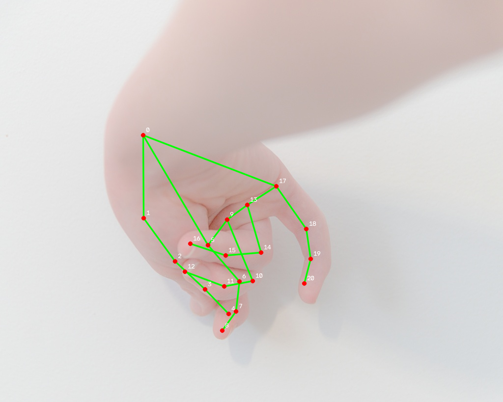

# SignBridge

手语翻译项目 —— MediaPipe 关键点组件库（基础层）。

当前版本（0.4.0）实现**手部关键点提取**（输入摄像头 / 视频文件 / 图片，输出每帧
0~N 只手的 21 个关键点，归一化坐标 + 米制 3D world 坐标，左右手判定，叠加可视化）
与**时序序列缓冲**（帧间多手追踪、ID 生命周期、滑动窗口、腕点归一化，
**特征增强匹配**：手形特征做跨位置丢失恢复，输出可直接喂 ST-GCN 的时序张量）
与 **ST-GCN 模型组件**（可插拔 `SkeletonClassifier` 协议 + 参数化图卷积实现）。

技术栈：Python · MediaPipe Tasks API · OpenCV · NumPy · PySide6 · PyTorch · ST-GCN

## 安装

```bash
pip install -e ".[dev]"
```

要求 Python ≥ 3.10（开发环境 3.14）；首次运行会自动下载模型
（hand_landmarker.task，约 7.8MB，缓存到 `~/.cache/signbridge/`）。

## 快速上手

```python
import cv2
from signbridge.hands import HandDetector, ImageSource

src = ImageSource("hand.jpg")
frame, _, _ = next(iter(src))
src.close()

detector = HandDetector(max_num_hands=2)   # 首次自动下载模型
hand_frame = detector.detect(frame)        # HandFrame(hands=..., timestamp_ms=..., frame_index=...)

for hand in hand_frame.hands:              # 无手时 hands 为空元组
    print(hand.handedness, hand.score)     # "Right" 0.98
    print(len(hand.landmarks))             # 21
    print(hand.world_landmarks[0])         # 腕部米制 3D 坐标（ST-GCN 空间特征）

overlay = draw_landmarks(frame, hand_frame)  # 叠加可视化（不改原帧）
cv2.imwrite("overlay.jpg", overlay)
detector.close()
```

## 时序序列缓冲（第二步）

把连续帧的手部关键点缓冲成按手 ID 稳定分离的时序序列，直接作为 ST-GCN 输入：

```python
import cv2
from signbridge import HandDetector, ImageSource, HandSequenceBuffer, OneEuroSmoother

buf = HandSequenceBuffer(
    window_size=60,                       # 滑动窗口（帧）
    max_lost_frames=10,                   # 手失联保留帧数，超时回收 ID
    # matcher 默认 FeatureHungarianMatcher：位置匹配 + 特征恢复（0.3.0 起）
    coordinate="world",                   # 米制 3D（ST-GCN 首选）
    smoother=OneEuroSmoother(),           # 可插拔：关键点平滑（None 关闭）
)

detector = HandDetector(max_num_hands=2)
src = ImageSource("hand.jpg", repeat=True)   # 单帧循环演示
for frame, _, _ in src:
    sequences = buf.update(detector.detect(frame))   # -> tuple[HandSequence, ...]
    for seq in sequences:
        print(seq.hand_id, seq.handedness)           # 0 "Left"
        print(seq.data.shape)                        # (60, 21, 3) 腕点归一化
        print(seq.valid_mask)                        # 丢失帧为 False（data 行 NaN）
    if buf.left_hand_id >= 0 and buf.right_hand_id >= 0:
        break
src.close()
detector.close()
```

`HandSequence.data` 为 (T, 21, 3) float32：每帧减去腕点坐标（腕点即原点），
`valid_mask` 标记真实数据（丢失帧 NaN 占位），可直接拼接为 (T, 2, 21, 3) 双通道
张量或按手独立喂给 ST-GCN。匹配与平滑均为可插拔协议：实现 `Matcher` /
`LandmarkSmoother` 协议即可替换（如光流匹配、卡尔曼平滑）。

## 特征增强匹配（0.3.0）

正常跟踪走位置匈牙利匹配；手短暂消失后从画面**另一侧**重新出现时，
用**手形特征**（210 维归一化距离矩阵，旋转/尺度/平移不变）做同一性判定：
置信度 ≥ `confidence_threshold`（默认 0.85）→ 恢复原 ID，否则视为新手。

两个可插拔协议：

- `FeatureExtractor`：21×3 点阵 → 特征向量（默认 `HandShapeFeature`）
- `FeatureVerifier`：两特征 → 置信度 [0,1]（默认 `DistanceFeatureVerifier`；
  **未来 transformer / GCN 相似度模型实现此协议即可替换**）

传 `matcher=HungarianMatcher()` 或 `feature_extractor=None` 可退回纯位置模式。

## ST-GCN 模型组件（0.4.0）

骨架时序分类模型，消费时序缓冲输出（`HandSequence.data`，`(T,21,3)` 腕点归一化）：

```python
import torch
from signbridge import STGCN, build_hand_graph

adj = build_hand_graph(num_hands=1)        # 21 节点单图；num_hands=2 → 42 双手分块图
model = STGCN(num_classes=10, adjacency=adj)  # 经典 9 层参数化

x = torch.randn(2, 3, 64, 21)              # (N, C=xyz, T, V)
logits = model(x)                          # (2, 10)
pred = model.predict(x)                    # (2,) 类别索引
```

- 输入 `(N, C, T, V)`；`num_nodes` 由邻接矩阵推导（换姿态图无需改模型）
- 模块化：`GraphConv`（图卷积 + 自适应图残差 B）/ `TemporalConv` / `STGCNBlock`（残差+BN）
- **可插拔**：任何模型实现 `SkeletonClassifier` 协议（`forward` + `predict`）即可替换 ST-GCN
- 训练管线（数据张量化、训练循环、数据集）为后续步骤

## CTC 连续手语训练（0.5.0 链路验证）

CE-CSL 是连续手语句子（无帧级时间戳），用 CTC 对齐词序列与时间步：

```python
import torch
from signbridge import STGCNCTC, build_hand_graph

model = STGCNCTC(num_classes=词表大小, adjacency=build_hand_graph(num_hands=2))
x = torch.randn(2, 3, 128, 42)          # (N, C, T, V)
logits = model(x)                        # (N, T'=32, K+1)，0=blank
lp = model.log_probs(x)                  # (T', N, K+1) log-softmax
pred = model.decode(logits)              # [[词id...], ...] 贪心解码
```

训练：`python scripts/train/train_ctc.py`（小样本链路验证）、
`python scripts/train/train_full.py`（正式训练，GPU + WER 评估）。
全量提取：`python scripts/extract/extract_dataset.py`。全量正式训练为后续步骤。

## CLI 演示工具

```bash
python -m signbridge.hands.cli --source camera --camera-id 0   # 摄像头实时叠加
python -m signbridge.hands.cli --source video --path demo.mp4  # 视频文件
python -m signbridge.hands.cli --source image --path hand.jpg  # 单张图片
python -m signbridge.hands.cli --source image --path hand.jpg --no-overlay  # 仅打印摘要
python -m signbridge.hands.cli --download-model                # 预下载模型
```

窗口内按 `q` / `Esc` 退出。

## API 速览

| 模块 | 内容 |
| --- | --- |
| `signbridge.core.landmarks` | `Landmark` / `Hand` / `HandFrame` 数据类；`HAND_CONNECTIONS`（21 条骨骼边）、`HAND_LANDMARK_NAMES`（21 点名） |
| `signbridge.core.errors` | `SignBridgeError` 及 `ModelNotFoundError` / `ModelDownloadError` / `SourceOpenError` / `InvalidArgumentError` |
| `signbridge.core.matching` | `Matcher` 协议 v2（`HandDescriptor`）+ `Matching` + `HungarianMatcher`（纯位置）/ `FeatureHungarianMatcher`（分层：位置 + 特征恢复） |
| `signbridge.core.features` | `FeatureExtractor` / `FeatureVerifier` 协议 + `HandShapeFeature`（210 维距离矩阵）/ `DistanceFeatureVerifier`（高斯核置信度） |
| `signbridge.core.smoothing` | `LandmarkSmoother` 协议 + `OneEuroSmoother(min_cutoff, beta, d_cutoff)`（可插拔平滑） |
| `signbridge.hands.detector` | `HandDetector(max_num_hands, min_detection_confidence, min_tracking_confidence, model_path=None, refine_roi=False, roi_target_size=256, roi_margin=0.35, candidate_confidence=0.15)`；`detect(bgr_frame) -> HandFrame`；支持 with 语句；`refine_roi` 两级候选检测改善远端小手识别 |
| `signbridge.hands.sources` | `CameraSource(camera_id)` / `VideoSource(path)`（含 `meta`）/ `ImageSource(path, repeat=False)`；统一产出 `(frame, frame_index, timestamp_ms)` |
| `signbridge.hands.draw` | `draw_landmarks(frame, hand_frame, color=None)` 与 `draw_landmarks_depth(frame, hand_frame)`（左蓝右绿、深度明暗） |
| `signbridge.hands.sequence` | `HandSequence`（T,21,3 腕点归一化 + valid_mask）与 `HandSequenceBuffer(window_size, max_lost_frames, matcher, coordinate, smoother, feature_extractor)` |
| `signbridge.core.graphs` | `build_adjacency` / `normalize_adjacency` / `build_block_diagonal_graph` / `build_hand_graph(num_hands=1\|2)`（图工具，姿态图扩展位） |
| `signbridge.models` | `SkeletonClassifier` 协议（整模型级可插拔）+ `STGCN(num_classes, adjacency, channels, strides, kernel_size, adaptive, dropout)` + `STGCNCTC`（CTC 帧级输出，连续手语识别） |
| `signbridge.hands.model` | `ensure_model()` / `cache_dir()` / `default_model_path()` |

## 手部关键点图谱（21 点）



| 索引 | 名称 | 索引 | 名称 | 索引 | 名称 |
| --- | --- | --- | --- | --- | --- |
| 0 | WRIST（腕） | 7 | INDEX_FINGER_DIP | 14 | RING_FINGER_PIP |
| 1 | THUMB_CMC | 8 | INDEX_FINGER_TIP（指尖） | 15 | RING_FINGER_DIP |
| 2 | THUMB_MCP | 9 | MIDDLE_FINGER_MCP | 16 | RING_FINGER_TIP（指尖） |
| 3 | THUMB_IP | 10 | MIDDLE_FINGER_PIP | 17 | PINKY_MCP |
| 4 | THUMB_TIP（指尖） | 11 | MIDDLE_FINGER_DIP | 18 | PINKY_PIP |
| 5 | INDEX_FINGER_MCP | 12 | MIDDLE_FINGER_TIP（指尖） | 19 | PINKY_DIP |
| 6 | INDEX_FINGER_PIP | 13 | RING_FINGER_MCP | 20 | PINKY_TIP（指尖） |

`HAND_CONNECTIONS` 共 21 条边：每指 4 条指骨边 × 5 指 + 腕→小指根 1 条手掌边。
这套骨架与边列表即后续 ST-GCN 图卷积的**节点与图边**。

## 测试

```bash
python -m pytest -v
```

测试图片取自 Wikimedia Commons（CC0），来源见 `tests/assets/README.md`。

## 路线图

- [x] 第一步：手部关键点提取组件（本版本）
- [ ] 第二步：时序序列缓冲 → ST-GCN 图数据（滑动窗口 + 手腕原点归一化）
- [ ] 静态手势分类（MediaPipe 内置）
- [ ] 人体姿态组件 `signbridge.pose`
- [ ] ST-GCN 训练与推理（PyTorch）
- [ ] Qt 界面（PySide6）：摄像头预览 / 关键点叠加 / 翻译结果显示
